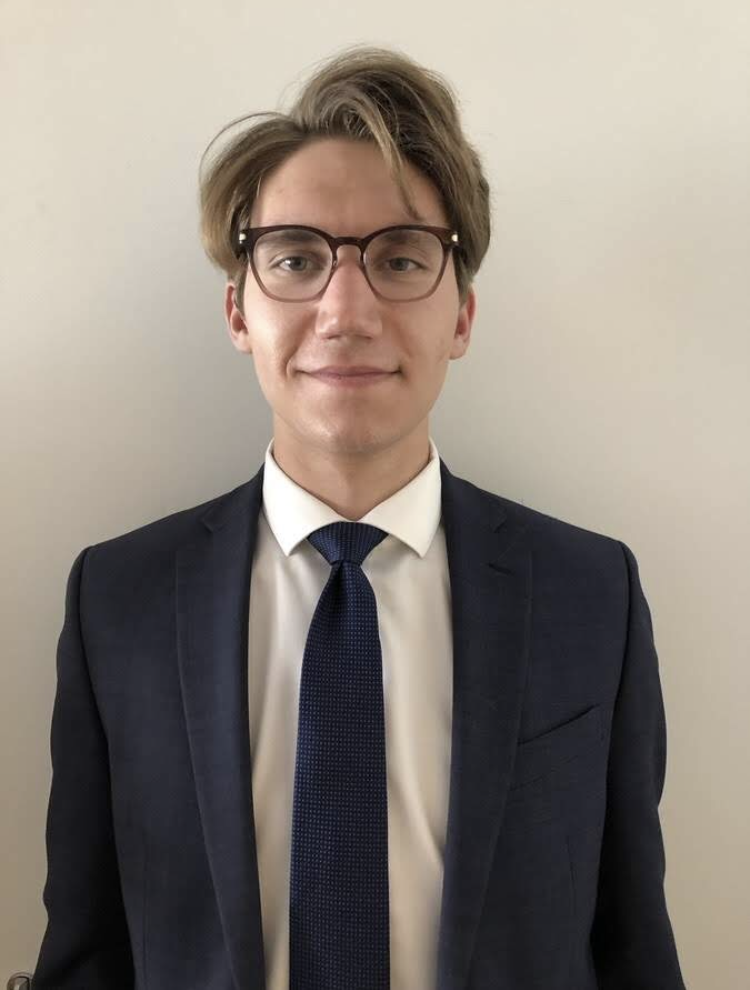

My name is Dylan Lucko, and I am a student at the George Washington University. I am graduating May '21 with a Bachelor's of Science in Economics and a minor in Statistics and Journalism. In the Fall, I will be attending GW for a Masters in Applied Economics.

As an undergraduate student in Economics, I have studied and conducted research on the distributional effects of Carbon Taxes as well as the supply chains of materials used in renewable energy production.

Upon the completion of my master's, I plan on working as a researcher at a VC or think tank trying to solve issues like income inequality and climate change. My resume and skill set can be found on this site under Experience and Skills, respectively.

GWU '21 B.S. Economics

GWU '23 M.A. Applied Economics

{width="2.2cm" height="2.7cm"}
